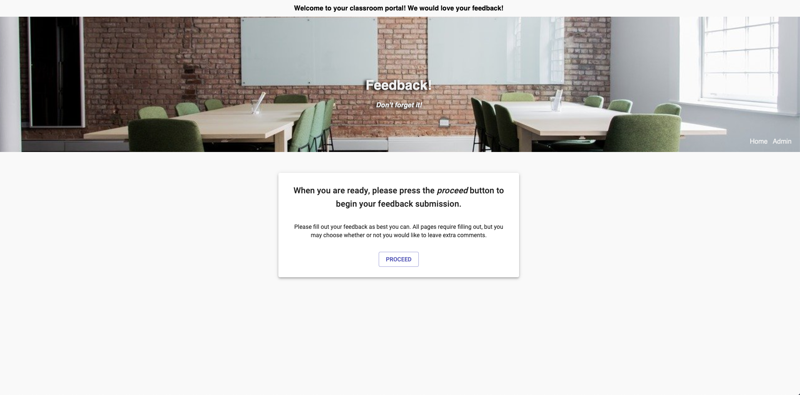
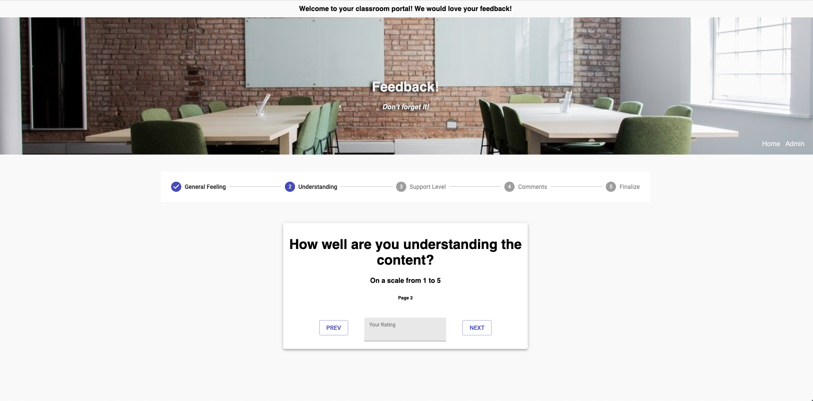
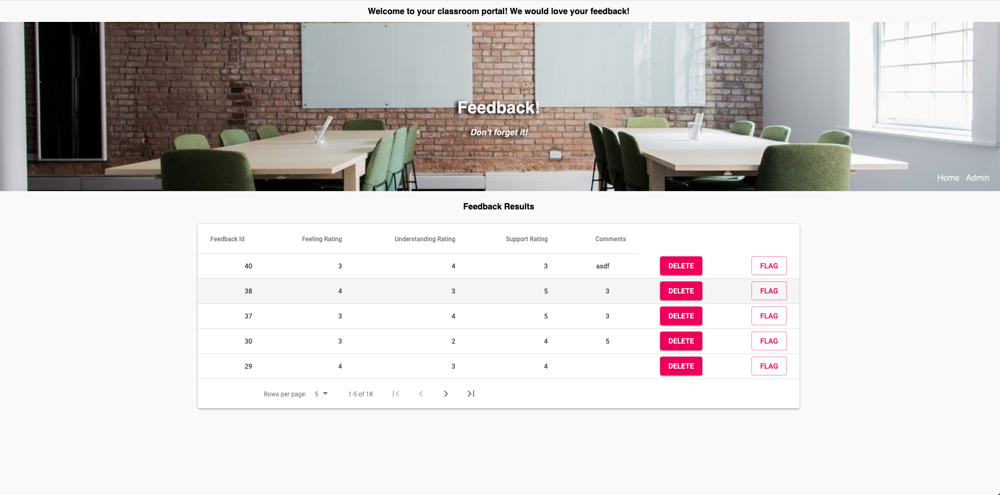

# Redux Feedback Loop
## Description
_Duration: Weekend Sprint_

This project uses React, Redux, and Axios on the front end, alongside node and a postgresQL database to create a feedback interface application. The user can use the interface to answer the feedback questions and leave comments which are stored in redux after each page reroute and sent through node to the database using an AXIOS POST request, where the information is stored.

The feedback table is then retrieved through an AXIOS GET request and the information is displayed on the DOM on the admin page. The admin can delete a chosen entry from the database by clicking on the delete button, or toggle the flagged status by clicking on flag. The flagged status is represented by background color of the entry.

The Deployed application can be found [here](https://personal-feedback-form.herokuapp.com/).

## Screenshots




### Prerequisites

- [Node.js](https://nodejs.org/en/)
- [PostgreSQL](https://www.postgresql.org/download/)
- Suggested to install [Postico](https://eggerapps.at/postico/) or a PostgreSQL GUI of your choosing.

## Installation

1. Get to main project directory in command line, and type in ```npm install``` to install required dependencies.
2. Create "prime_feedback" database in host "localhost".
3. Run commands from database.sql file in GUI to create table, in ```prime_feedback``` database.
4. Run ```npm start``` in the command line in the project repository.
5. Also run ```npm run client``` in a seperate command line window in the project repository.
6. A new tab will open in your default browser, with the development project.

## Usage
1. Navigate from the start of the form by pressing proceed, and continuing through the prompts to the review page. 
2. You must enter a number between 1 and 5 in the first three feedback prompts. You may then enter comments.
3. You can review your entries on the review page, then submit them if you are satisfied. If not, navigate back by clicking the ```prev``` buttons until you are back at the page you would like to change, or start fresh by clicking home in the bottom right corner of the header.
4. Once you submit, you will see a success prompt, and will have the chance to navigate back to the home page.
5.  Admins may see all of the feedback information on the admin page, which you can navigate to by clicking the admin button in the bottom right corner of the header. 
6. The admin may flag or delete each of the entries as they see fit.


## Built With
- _node.js_
- _Express.js_
- _React_ 
- _Redux_
- _postgreSQL_
- _MaterialUI_

## Support

If you have any questions, feel free to email me at bakerpj1992@gmail.com

---

## Where I want to go from here

1. [x] Use cards and styles to further progress the Material UI styling on the front end.
2. Further style with Material UI, using components like inputs, and improving the form fields.